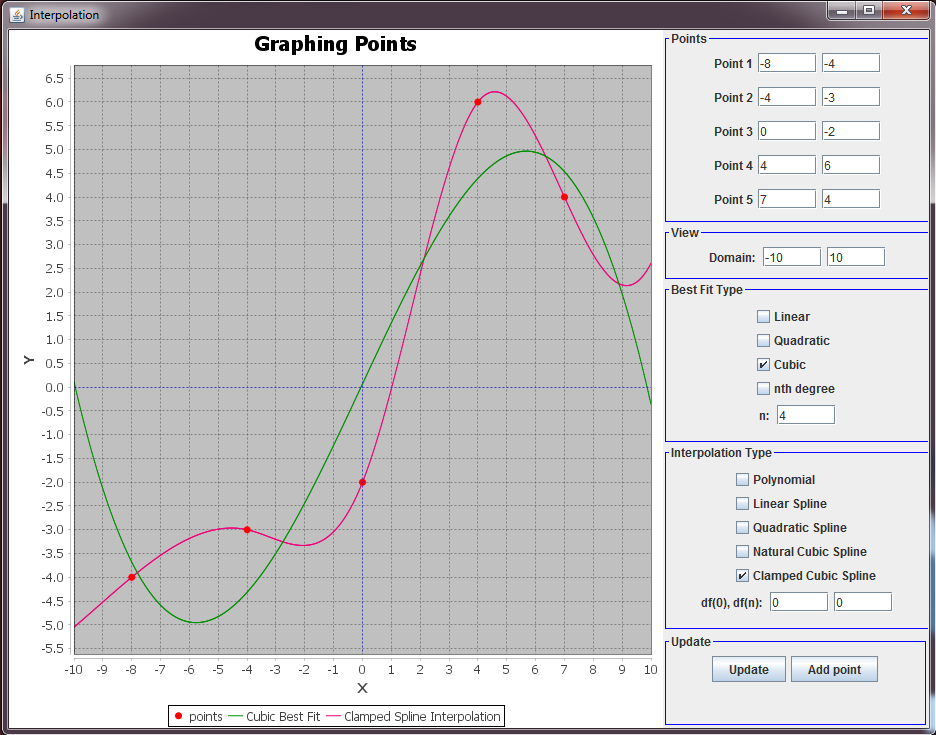

# Interpolation_Graphs

GUI for graphing interpolation functions. Uses jfreechart library. Run MainView to start the program.

Can Graph:

* Best Fit Curves
  - Linear
  - Quadratic
  - Cubic
  - nth degree
* Interpolation
  - Polynomial
  - Linear Spline
  - Quadratic Spline
  - Natural Cubic Spline
  - Clamped Cubic Spline with user defined derivatives for start and end points

Example:

